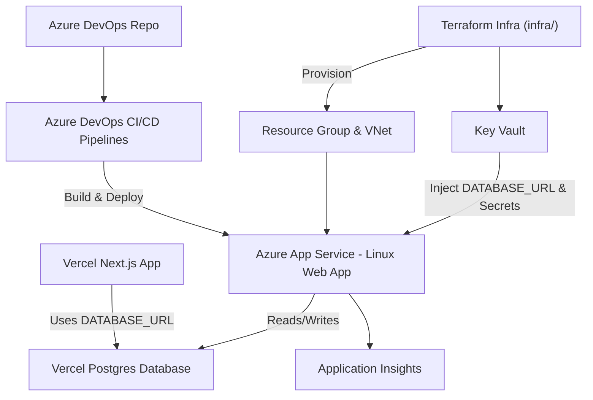

# Next.js App Migration to Azure

**Owner:** Benson Ibeabuchi  

This project demonstrates migrating a simple Next.js web app hosted on **Vercel** (with Vercel Postgres) to **Azure App Service**, while maintaining the same database. The migration involves **Azure DevOps CI/CD**, **Terraform for infrastructure-as-code**, and **VNet integration** for secure network egress.  

---

## Objective

Migrate a simple web app hosted on Vercel to Azure App Service, using:

- **Azure DevOps** for CI/CD  
- **Terraform** for secure infrastructure deployment  
- **VNet integration** for controlled network egress  

The app continues to use the same **Vercel Postgres database** to avoid additional costs, while being fully deployed and managed in Azure.

---

## Project Tasks & Deliverables

### 1. Create and deploy the base app on Vercel

- Build a small Next.js web app.  
- Connect it to **Vercel Postgres** and seed sample data.  
- Push code to **GitHub** and deploy on **Vercel**.  
- Confirm functionality (view, add, list data).  

**Deliverable:** Live Vercel app URL showing sample data.

---

### 2. Mirror repository into Azure DevOps

- Import or mirror the GitHub repo into **Azure Repos**.  
- Maintain the same branch structure and history.  

**Deliverable:** Code visible in Azure Repos.

---

### 3. Define infrastructure with Terraform

Terraform project (`infra/`) provisions:

- **Resource Group**  
- **Virtual Network & Subnet**  
- **Key Vault** (store `DATABASE_URL`)  
- **App Service Plan & Linux Web App**  
- **Application Insights**  
- Enable **VNet integration** on App Service  
- Store secrets securely in **Key Vault** or pipeline variables  

**Deliverable:** Successful Terraform plan & apply with outputs showing Azure App URL.

---

### 4. Build Azure DevOps CI/CD Pipelines

**Infrastructure pipeline:**

- Initialize Terraform, run plan & apply automatically on changes to `/infra`.  

**Application pipeline:**

- Build and package the app from Azure Repos.  
- Deploy to Azure App Service.  
- Inject `DATABASE_URL` from Key Vault or secret variables.  

**Deliverable:** Two pipelines (infra + app), both passing successfully.

---

### 5. Connect to the same Vercel Postgres

- Use the **existing `DATABASE_URL`** from Vercel.  
- Update Azure App Service settings to reference it.  

**Deliverable:** Azure app connects to the same database as Vercel app.

---

### 6. Test the migration

- Verify the Azure-hosted app shows the same data.  
- Add new records and confirm changes appear in both Vercel and Azure versions.  

**Deliverable:** Screenshots showing shared data and working Azure URL.

---

### 7. Security & validation

- Secrets not hardcoded or stored in repo.  
- App integrated with **VNet** for secure network traffic.  
- **Application Insights** enabled for monitoring.  

**Deliverable:** Short summary (1-page max) describing security setup.

---

## Getting Started (Development)

```bash
# Install dependencies
npm install

# Run development server
npm run dev
# Open http://localhost:3000

```

You can start editing app/page.tsx. Changes auto-update in the browser.


### 7. Deployment

**Vercel: Original app with sample data**

**Azure App Service: Migrated app, using the same database**

- Both apps should function identically, demonstrating a secure and CI/CD-managed migration to Azure.


---

## Architecture Diagram

Below is a high-level overview of the migration architecture from **Vercel** to **Azure App Service**:



## Description:

**Vercel App: Original Next.js app hosting sample data.**

**Vercel Postgres: Shared database between Vercel and Azure apps.**

**Azure DevOps Repo & Pipelines: Automates app build, deployment, and infrastructure provisioning.**

**Azure App Service: Fully managed Linux Web App in Azure, integrated with VNet and Key Vault.**

**Terraform: Infrastructure-as-code defines network, Key Vault, App Service, and other resources.**

**Application Insights: Monitors app performance and logs for the Azure deployment.**